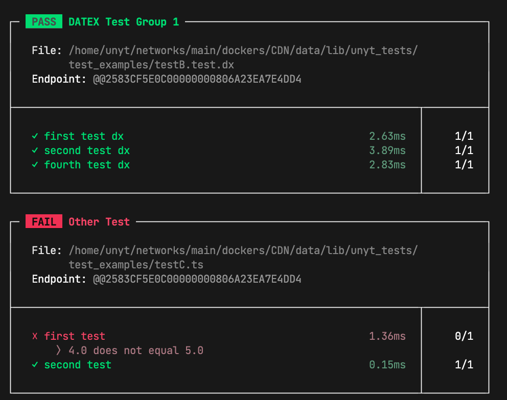

# Unyt Test Library

Test runner for backend + frontend 
with integrated watch mode and report file generation.

Used in [UIX](https://uix.unyt.org).

Currently supported languages:
 * TypeScript
 * JavaScript
 * [DATEX](https://datex.unyt.org/)



## Write Tests for TypeScript and JavaScript

Example
```typescript

import { Assert } from "unyt_tests/testing/assertions.ts";
import { Test, Timeout } from "unyt_tests/testing/test.ts"

@Test export class DatexJSONObjects {

	@Test(
		[1, 2, 3],
		[4, 4, 8],
		[6, 2, 8]
	) 
	sumIsCorrect(a:number, b:number, sum:number){
		Assert.equalsStrict(a+b, sum)
	}

	@Test
	testWithOutParameters(){
		Assert.true(true)
	}

	@Test
	@Timeout(10*60) 
	async longDurationTest(){
		// test can take up to 10 minutes (10*60s) to complete
	}
}
```


## Run tests in the command line

### Automatically detect tests in current working directory:
```bash
deno run -A --import-map http://dev.cdn.unyt.org/importmap.json https://dev.cdn.unyt.org/unyt_tests/run.ts -w
```
 
With the `-w` flag, the tests are run in watch mode - when you update a test file, the tests are automatically reevaluated.

As a default import map, `https://dev.cdn.unyt.org/importmap.json` can be used, but you can also use a different import map.

### Specifying test files
```bash
deno run -Aq --import-map [IMPORT_MAP] https://dev.cdn.unyt.org/unyt_tests/run.ts -w testA.ts testB.js testC.js testD.dx
```

### Options
See <RUN.md> or run 
```bash
deno run -Aq --import-map [IMPORT_MAP] https://dev.cdn.unyt.org/unyt_tests/run.ts -h
```
 * `--color` or `-c`: Set the color mode of the output ("rgb", "simple", or "none")
 * `--reporttype`: Set the type for the report file generation, currently supported types: "junit"
 * `--reportfile`: Set the path for the report output. When this option is set, a report is generated after all tests are finished.
 * `--watch` or `-w`: Run in watch mode, tests get automatically executed when a test file is updated
 * `--verbose` or `-v`: verbose output for debugging purposes


## Logging

You can import the `testLogger` from `unyt_tests/core/logger.ts` to show logs in the console even in watch mode.

```ts
import { testLogger } from "unyt_tests/core/logger.ts";

@Test export class MyTests {
	@Test firstTest() {
		testLogger.log("hello");
	}
}
```

## Development

To test the test library locally, run
```bash
deno run -Aq --import-map ./importmap.local.json ./run.ts test_examples/
```